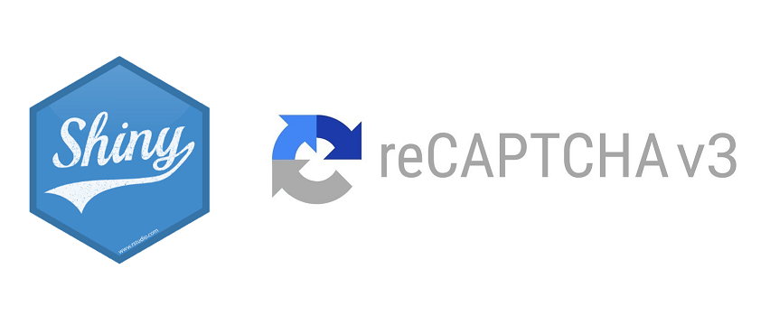

# shinygCAPTCHAv3



Package to use Google reCAPTCHAv3 in RShiny web application.

How to install
--------------

Run the below command to install the package

``` r
devtools::install_github("sarthi2395/shinygCAPTCHAv3")
```

Sample App
----------

At this stage, you should have already registered your domain in reCAPTCHA admin console and have the site and secret keys ready.

``` r
library(shiny)
library(shinyjs)
library(shinygCAPTCHAv3)

ui <- fluidPage(
  useShinyjs(),
  GreCAPTCHAv3Ui(<your site key>,"homepage","responseReceived")
)

server <- function(input, output, session) {
  
  observeEvent(input$responseReceived,{

    result <- GreCAPTCHAv3Server(<your secret key>,input$responseReceived)
    
    if(result$success){
      
      info(result)

    }
  })
  
}

shinyApp(ui, server)
````
